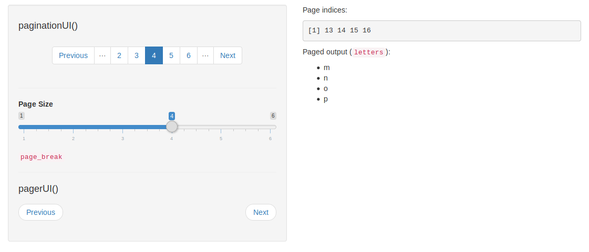

<!-- README.md is generated from README.Rmd. Please edit that file -->

# shinyThings

## Installation

You can install shinyThings from Github via

``` r
# install.packages("remotes")
remotes::install_github("gadenbuie/shinyThings")
```

## Components

  - [Dropdown Buttons](#dropdownbutton)
  - [Pagination UI](#pagination)
  - [Toggle Button Groups](#toggle-button-groups)
  - [Radio Switch Buttons](#radio-switch-buttons)

### dropdownButton


Implements [Bootstrap 3 Button
Dropdowns](https://getbootstrap.com/docs/3.3/components/#btn-dropdowns)
using Shiny modules.

``` r
# Try it out
shinyThings::buttonGroupDemo()
```

<details>

<summary>Demo Code</summary>

``` r
button_options <- c(
  "Eleven" = "eleven",
  "Will Byers" = "will",
  "Mike Wheeler" = "mike",
  "Dustin Henderson" = "dustin",
  "Lucas Sinclair" = "lucas"
)

ui <- fluidPage(
  titlePanel("shinyThings Dropdown Button"),
  sidebarLayout(
    sidebarPanel(
      shinyThings::dropdownButtonUI(
        id = "dropdown",
        options = button_options,
        label = "Characters"
      )
    ),
    mainPanel(
      tags$p("The last button pressed was ..."),
      verbatimTextOutput("chosen")
    )
  )
)

server <- function(input, output) {
  last_clicked <- shinyThings::dropdownButton("dropdown", button_options)
  output$chosen <- renderPrint({ last_clicked() })
}
```

</details>

## Pagination



Implements [Bootstrap 3 pagination and
pagers](https://getbootstrap.com/docs/3.3/components/#pagination) using
Shiny modules.

``` r
# Try it out
shinyThings::pagerDemo()
```

<details>

<summary>Demo Code</summary>

``` r
ui <- fluidPage(
  titlePanel("shinyThings Pagination"),
  sidebarLayout(
    sidebarPanel(
      width = 6,
      
      tags$h4("paginationUI()"),
      shinyThings::paginationUI("pager", width = 12, offset = 0, class = "text-center"),
      tags$hr(),
      
      sliderInput("page_break", "Page Size", min = 1, max = 6, step = 1, value = 3),
      helpText(tags$code("page_break")),
      tags$hr(),
      
      tags$h4("pagerUI()"),
      shinyThings::pagerUI("pager", centered = FALSE)
    ),
    mainPanel(
      width = 6,
      
      tags$p("Page indices:"),
      verbatimTextOutput("page_indices"),
      
      tags$p(HTML("Paged output (<code>letters</code>):")),
      uiOutput("paged_output")
    )
  )
)

server <- function(input, output) {
  ## page_break and n_items can be reactive or fixed values
  # page_break <- 4
  # n_items <- length(letters)
  n_items <- reactiveVal(length(letters))
  page_break <- reactive({input$page_break})

  page_indices <- shinyThings::pager("pager", n_items, page_break)

  output$page_indices <- renderPrint({
    page_indices()
  })

  output$paged_output <- renderUI({
    tags$ul(
      lapply(letters[page_indices()], tags$li)
    )
  })
}
```

</details>

### Toggle Button Groups


Implements groups of toggle buttons using [Bootstrap 3 button
toolbars](https://getbootstrap.com/docs/3.3/components/#btn-groups) as a
Shiny input. Each button can be toggled **on** or **off**, and the group
may be limited to a single **on** button at a time, or multiple active
buttons. (For one-button-always-selected behavior, see [radio switch
buttons](#radio-switch-buttons) below.)

``` r
# Try it out
shinyThings::buttonGroupDemo()

# UI Side
shinyThings::buttonGroup("input-id", choices = letters[1:3])

# Server Side
shinyThings::updateButtonGroupValue("input-id", values = "b")
```

<details>

<summary>Demo Code</summary>

``` r
library(shiny)

ui <- fluidPage(
  titlePanel("shinyThings Toggle Button Groups"),
  fluidRow(
    column(
      width = 6,
      tags$h4("Buttons with icons"),
      shinyThings::buttonGroup(
        inputId = "button_icon",
        choices = c("left", "center", "justify", "right"),
        btn_icon = paste0("align-", c("left", "center", "justify", "right")),
        multiple = FALSE
      ),
      tags$p(),
      verbatimTextOutput("chosen_icon")
    ),
    column(
      width = 6,
      tags$h4("Buttons with HTML"),
      shinyThings::buttonGroup(
        inputId = "button_html",
        choices = c("bold", "italic", "underline", "strikethrough"),
        choice_labels = list(
          HTML("<strong>B</strong>"),
          HTML("<i>I</i>"),
          HTML("<span style='text-decoration: underline'>U</span>"),
          HTML("<del>S</del>")
        ),
        multiple = TRUE
      ),
      tags$p(),
      verbatimTextOutput("chosen_html")
    )
  )
)

server <- function(input, output, session) {
  output$chosen_icon <- renderPrint(input$button_icon)
  output$chosen_html <- renderPrint(input$button_html)
}

shinyApp(ui, server)
```

</details>

### Radio Switch Buttons


Implements a button-styled version of `shiny::radioButtons()`. One
button is always active (unless unset by the app).

Adapted from CSS code by Mike Hemberger described in
<https://thestizmedia.com/radio-buttons-as-toggle-buttons-with-css/>.

``` r
# Try it out
shinyThings::radioSwitchButtonsDemo()

# UI Side ----
# Set Default style
shinyThings::radioSwitchButtons_default_style(selected_background = "#00589a")
# Create input
shinyThings::radioSwitchButtons("input-id", choices = letters[1:5])

# Server Side ----
shinyThings::updateRadioSwitchButtons("input-id", selected = "b")
```

<details>

<summary>Demo Code</summary>

``` r
library(shiny)
library(shinyThings)

ui <- fluidPage(
  inputPanel(
    radioSwitchButtons(
      inputId = "other",
      label = "Yes or No?",
      choices = c("Yes" = "yes", "No" = "no", "Maybe?" = "maybe"),
      selected_background = "#eb1455"
    ),

    radioSwitchButtons(
      inputId = "small",
      label = "Style",
      choices = c("plain", "bold", "italic"),
      choice_labels = list(
        tags$span(style = "font-weight: normal", "P"),
        tags$strong("B"),
        tags$em("I")
      )
    )
  ),
  verbatimTextOutput("values")
)

server <- function(input, output, session) {
  output$values <- renderPrint({
    str(list(
      moreThanTwo = input$other,
      style       = input$small
    ))
  })
}

shinyApp(ui, server)
```

</details>
